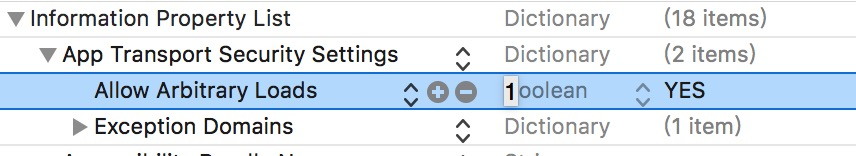

## ios上只支持https的网络请求，按如下配置可支持http请求

找到项目下的Info.plist文件
添加一项`App Transport Security Settings`为Dictionary(如果有App Transport Security Settings，那忽略)
在`App Transport Security Settings`下面添加一项`Allow Arbitrary Loads`，boolean类型，值为YES

**如下图**

**参考链接**

[解决react native使用fetch函数在ios9报network request failed的问题](http://blog.csdn.net/liyijun4114/article/details/51792179)